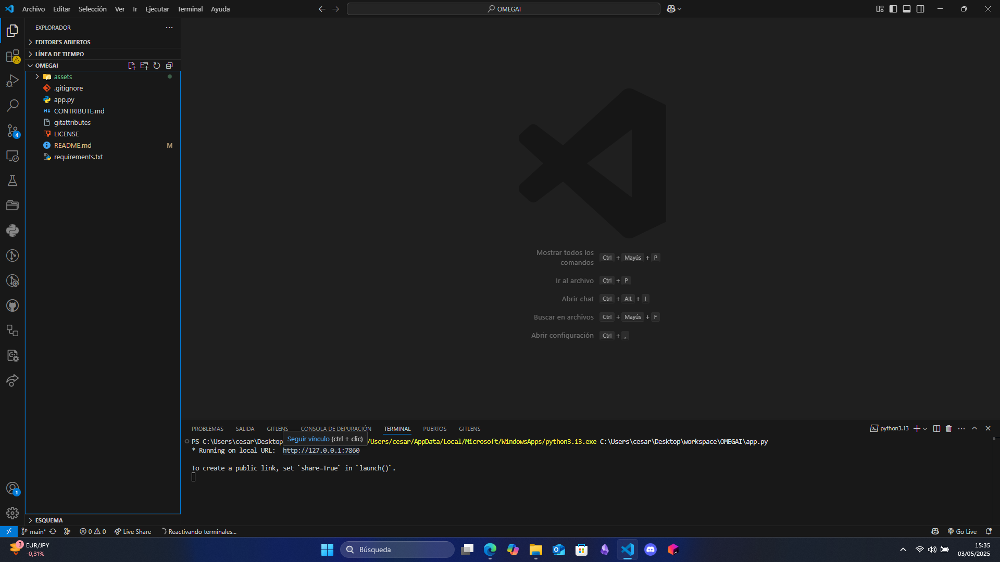
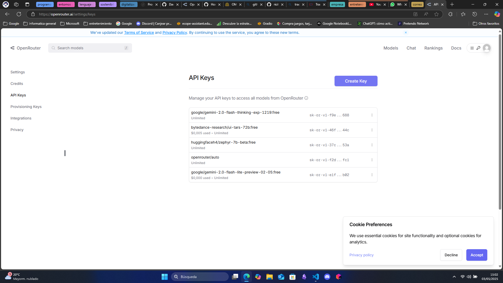
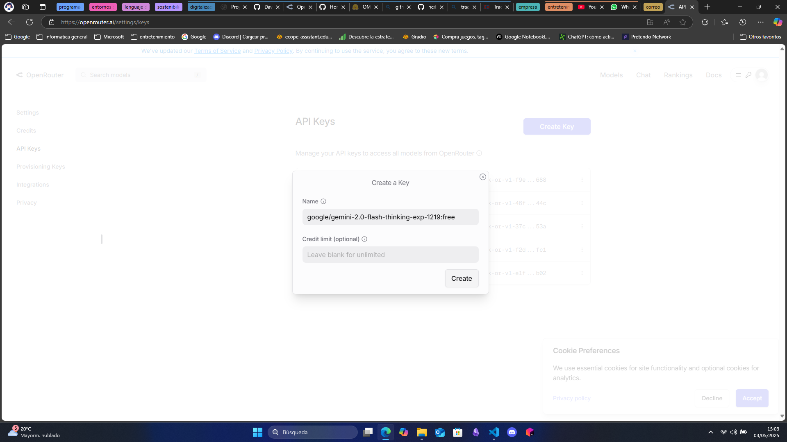
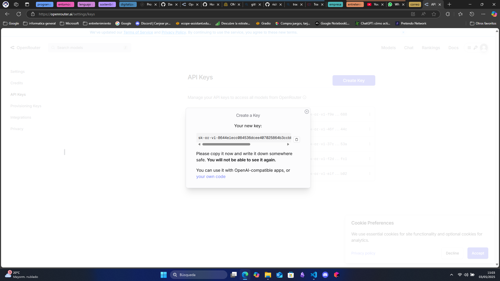

# OMEGAI 😎💬

<p align="center">
  <a href="https://github.com/ricitos2001/OMEGAI/pulls">
    
  </a>
  <a href="LICENSE">
      
    </a>
    <a href="https://github.com/pylint-dev/pylint">
      
    </a>
</p>

OMEGAI 😎💬 is the new AI model tool made with [Python](https://www.python.org/) and [Gradio](https://www.gradio.app/), asociated with [openrouter.ai](https://openrouter.ai/) and designed to make it easier to use and access different AI models. Unlike current AI models, OMEGAI is a multifunctional tool that allows different versions of different AI models to be used.
This approach aims to improve the current use of artificial intelligence models, guaranteeing an improvement in accessibility and a great user experience.

> **Important Note:** OMEGAI 😎💬 is not intended to replace the work of current AI models, but aims to make current AI models easier to use and access. OMEGAI offers a simple way to works with every AI model in one unic place.

<p align="center">
    <a href="https://huggingface.co/spaces/ricitos2001/OMEGAI">Demo</a>
    ·
    <a href="https://github.com/ricitos2001/OMEGAI/issues/new?assignees=&labels=bug&projects=&template=bug_report.md&title=%5BBUG%5D">Report Bug</a>
    ·
    <a href="https://github.com/ricitos2001/OMEGAI/issues/new?assignees=&labels=enhancement&projects=&template=feature_request.md&title=%5BREQUEST%5D">Request Feature</a>
    ·
    <a href="https://github.com/ricitos2001/OMEGAI/wiki">Wiki</a>
</p>

## Index
[Motivation](#motivation)

[Why OMEGAI?](#why-omegai)

[How OMEGAI works](#how-omegai-works)

[Demo](#demo)

[Getting started](#getting-started)

[License](#license)

[Contributing](#contributing)

[References](#references)

## Motivation
The reason I wanted to do this project was that I wanted to create a tool that would allow me to work with all the AIs that currently exist without having to search for them one at a time.
Other reasons why I wanted to do this was because of the interest I have in artificial intelligence in addition to the fact that the gradio library was very curious

## Why OMEGAI?
I decided put the name thinking that it would be the ultimate AI modeling tool for every uses

## How OMEGAI works
OMEGAI works with the Openrouter API and with the libraries from python an openai
1. select your AI model: OMEGAI 😎💬 have some AI models. You can select the AI model that you want
2. Put your API key of the AI model selected: if you don't know how, you can follow the steps from running
3. System Prompt: you can configure the behaviour of the AI using the system prompt
4. Prompt textBox: whrite your question in your textBox
5. Chat completion: the AI will give you a resopnse using the configured system prompt and the question from the prompt textbox

## Demo
You can try 😎💬 OMEGAI following this link: https://huggingface.co/spaces/ricitos2001/OMEGAI
or following this link: https://ricitos2001-omegai.hf.space/

## Getting started
Getting Started
To get started with 😎💬 OMEGAI, follow these steps:

### Prerequisites
Ensure you have the following installed on your system:

- git (for cloning the repository)
- Python 3.8 or higher
- pip (Python package installer)
- The libraries and packages from the file [requirements.txt](requirements.txt)

### Clone the repository
Before proceeding with the configuration or installation, you need to clone the repository. This is a common step required for all installation methods.
1. Clone the repository: git clone ```https://github.com/ricitos2001/OMEGAI.git```
2. Navigate into the project directory: ```cd OMEGAI```

### Running
1. Run the program and follow the link from the CMD


2. Follow this link from OpenRouter.ai and make your API key: https://openrouter.ai/settings/keys

3. Make your API key



4. Copy your API key


5. Paste your API key in the configuration section

## License
😎💬 Aphra is released under the [MIT License](./LICENSE). You are free to use, modify, and distribute the code for both commercial and non-commercial purposes.

## Contributing
Contributions to 😎💬 Aphra are welcome! Whether it's improving the code, enhancing the documentation, or suggesting new features, your input is valuable. Please check out the [CONTRIBUTING.md](./CONTRIBUTE.md) file for guidelines on how to get started and make your contributions count.

## References
- This software is deploymend with Gradio: https://www.gradio.app/ and made with Python: https://www.python.org/
- Visit OpenRouter.ai: https://openrouter.ai/
- Visit openai: https://openai.com/
